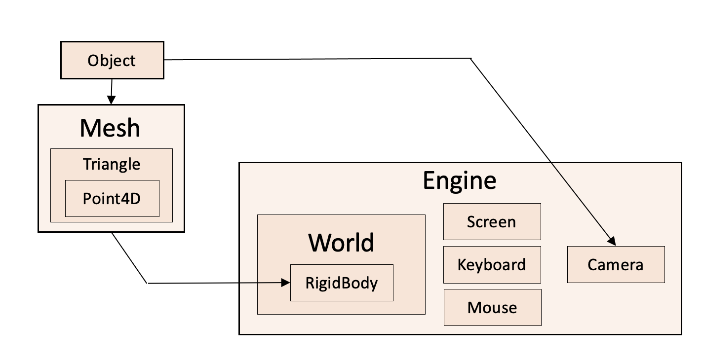

<h4>Установка и запуск:</h4>

1) Скачайте и установите библиотеку [OpenAL](https://openal.org/downloads/), которая необходима для поддержки звуков в SFML (без [OpenAL](https://openal.org/downloads/) движок не запустится).

2) Установите [SFML](https://www.sfml-dev.org/download.php) в вашу систему (<b>Версия компилятора должна совпадать на 100%</b>).

3) Выберете подходящий редактор кода. Например, [CLion](https://www.jetbrains.com/clion/) или [Visual Studio](https://visualstudio.microsoft.com/ru/).
     

4) Клонируйте этот репозиторий.
    

5) Соберите проект, добавив в цель сборки один из файлов lesson(n).cpp

Если у вас возникли какие-либо трудности в работе с репозиторием или вы нашли ошибку, то лучше всего будет создать [issue](https://docs.github.com/en/issues/tracking-your-work-with-issues/creating-an-issue).

Общая структура проекта:

=======
# GameEngine
My 3D game engine
>>>>>>> 5f36d8baa03ec79699c42e4b024bcc385cdee224
